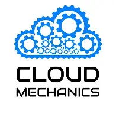

div align="center">

# ☁️ Weekly Azure Lab Series

**Hands-on Azure learning — one lab at a time.**

*A Community Initiative by Cloud Mechanics × Eng. Mahmoud Atallah*

---

---

## 📌 About the Series

We are thrilled to officially launch the **Weekly Azure Lab Series** — a practical, community-driven initiative designed to give you real, hands-on experience with Microsoft Azure.

Each session focuses on a **specific lab design**, broken down and implemented step-by-step together. No fluff, no slides-only theory — just real work in a real cloud environment.

---

## 🗓️ Session Details

| Detail | Info |
|---|---|
| 📅 **Schedule** | Every **Wednesday** |
| 🕗 **Time** | **8:00 PM** — Egypt Time (UTC+2) |
| 💻 **Platform** | Microsoft Teams |
| 🎥 **Recordings** | Available after each session *(God willing)* |

---

## 🎯 Who Is This For?

This series is open to **everyone** — no experience required.

- 🌱 Just starting your Azure journey? **You belong here.**
- 🏗️ Want to build a solid cloud foundation from scratch? **This is for you.**
- 👥 Looking to join an active, knowledge-sharing community? **Welcome home.**

---

## 📚 Curriculum Overview

We begin from the very basics and progressively build toward more complex cloud architectures.

### Phase 1 — Foundations
- [ ] Networking Basics
- [ ] Azure Core Concepts
- [ ] Virtual Networks & Subnets

### Phase 2 — Core Services *(Coming Soon)*
- [ ] Compute & Virtual Machines
- [ ] Storage Accounts
- [ ] Identity & Access Management

### Phase 3 — Advanced Architectures *(Coming Soon)*
- [ ] Hub-and-Spoke Topologies
- [ ] High Availability & Load Balancing
- [ ] Security & Monitoring

> 📌 *Topics are subject to expansion based on community feedback and interest.*

---

## ⚡ Requirements

| Requirement | Details |
|---|---|
| 🧠 **Prior Knowledge** | None — zero prerequisites |
| 👀 **Watch & Learn** | You can join just to observe and follow the logic |
| ☁️ **Azure Account** | Optional — needed only if you want to apply steps in real-time |
| 💳 **Azure Credits** | We aim to provide credits to some participants over time |

> 💡 **Don't have an Azure account yet?**  
> You can create a free account at [azure.microsoft.com/free](https://azure.microsoft.com/free) and get $200 in credits.

---

## 👨‍💻 Your Hosts

<table>
  <tr>
    <td align="center">
      <b>Cloud Mechanics Team</b> 
      Community Organizers & Lab Designers
    </td>
    <td align="center">
      <b>Eng. Mahmoud Atallah</b> 
      Co-Organizer & Technical Lead
    </td>
  </tr>
</table>

The team currently handles **organizing, managing, and explaining** all labs — with the ultimate goal of fostering **real interaction and knowledge sharing** within the community. 🤍

---

## 🔔 Stay Updated

Session details and joining links will be announced **very soon!**

- 🔗 Follow us on our community repo: [3tallah/CloudMechanicsCommunity-Mentorship](https://github.com/3tallah/CloudMechanicsCommunity-Mentorship/tree/main)
- 📢 Share this with anyone who wants to start their Azure journey
- ⭐ Star this repo to stay notified of updates

---

## 🤝 Community Values

We believe in:

- **Learning by doing** — labs over lectures
- **Inclusion** — everyone is welcome, regardless of level
- **Sharing** — knowledge grows when it's shared
- **Growth** — from basics to advanced, together

---

**Made with 🤍 by Cloud Mechanics**

*Stay tuned — the cloud awaits!* ☁️

